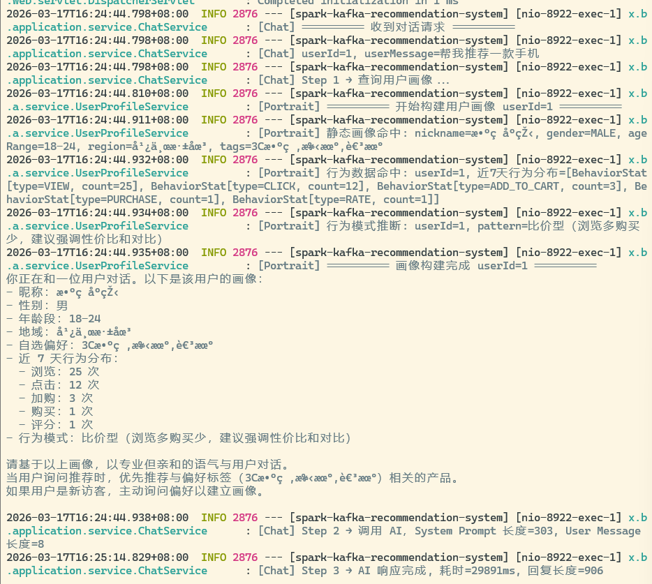
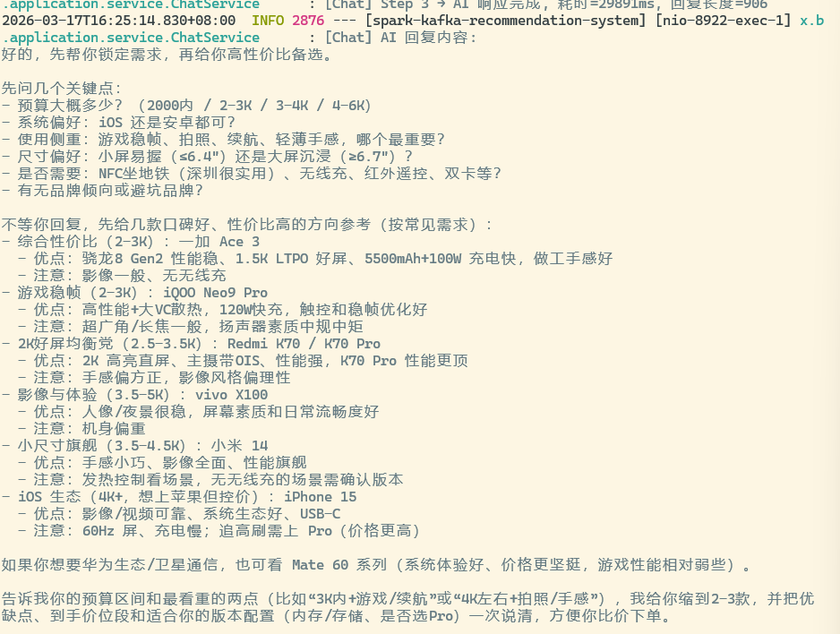

# Real-time Recommendation System

基于 **Spring Boot 3.5 + Kafka + Spark 4.0 + Spring AI** 的实时推荐系统。

系统从 Kafka 消费用户行为事件，通过 Spark 双流水线并行处理：一条聚合用户行为写入 MySQL 用于报表分析，另一条计算物品偏好评分生成 Top-N 推荐结果写回 Kafka。同时集成 Spring AI，基于用户画像（静态属性 + 动态行为）生成个性化 System Prompt，实现 AI 对话推荐。

---

## 系统架构

```
                         ┌──────────────────────────────┐
                         │      StreamController         │
                         │  POST /start /stop /event     │
                         └──────────┬───────────────────┘
                                    │
                    ┌───────────────┼───────────────┐
                    ▼                               ▼
          StreamSimulatorService            手动发送单条事件
          (模拟器：100用户×500商品)
                    │
                    ▼
          BehaviorEventProducer
          (JSON 序列化 → Kafka)
                    │
                    ▼
        ┌───────────────────────┐
        │   Kafka: user-events  │
        └───────────┬───────────┘
                    │
                    ▼
        KafkaEventDeserializer
        (binary → 结构化 DataFrame)
                    │
          ┌─────────┴─────────┐
          ▼                   ▼
    流水线 1: 聚合         流水线 2: 推荐
    30s窗口聚合            偏好评分计算
    userId×behaviorType    userId×itemId
          │                   │
          ▼                   ▼
    MySQL (upsert)      Kafka: recommendations
    行为报表              Top-N 推荐结果
          │
          ▼
    ┌─────────────────────────────────────┐
    │         AI 画像对话链路              │
    │                                     │
    │  ChatController                     │
    │    └→ ChatService                   │
    │         └→ UserProfileService       │
    │              ├→ user_profile (静态) │
    │              └→ behavior_agg (动态) │
    │              └→ 拼装 System Prompt  │
    │         └→ Spring AI ChatClient     │
    │              └→ GPT-4o-mini 回复    │
    └─────────────────────────────────────┘
```

---

## 已实现的功能

### 核心流处理

- **双流水线架构**：两条 Spark Streaming 查询共享同一个 Kafka 数据源，Spark 内部优化为单次读取
- **行为聚合流水线**：30 秒滚动窗口，按 `userId × behaviorType` 聚合 `eventCount` 和 `avgRating`，通过 JDBC upsert 幂等写入 MySQL
- **推荐评分流水线**：30 秒滚动窗口，按 `userId × itemId` 计算偏好总分，取每用户 Top-N 推荐结果写入 Kafka

### 偏好评分模型

| 行为类型     | 分值      | 含义                     |
| :----------- | :-------- | :----------------------- |
| VIEW / CLICK | 1.0       | 弱兴趣信号               |
| ADD_TO_CART  | 3.0       | 中等购买意图             |
| PURCHASE     | 5.0       | 强转化信号               |
| RATE         | 0.0 - 4.0 | 用户主动评分，归一化处理 |

### DDD 领域模型

- **Entity**：`BehaviorEvent`（Builder 模式构建 + 参数校验）
- **Value Object**：`BehaviorType`（枚举，含权重定义）、`Rating`（值对象，范围 1.0-5.0）
- **Aggregate**：`UserBehaviorAggregate`（用户行为聚合根）
- **Domain Service**：`BehaviorAnalysisService`（异常行为检测：1 小时 >1000 事件判定异常）

### Kafka 生产者

- 幂等生产者（`enable.idempotence=true`）
- `acks=all` 确保所有 ISR 副本确认
- LZ4 压缩，批量发送优化吞吐
- userId 作为 partition key，保证同一用户的事件有序

### 数据库持久化

- `user_behavior_aggregation` 表存储窗口聚合结果
- `user_profile` 表存储用户静态画像（性别、年龄段、地域、偏好标签）
- `item_catalog` 表存储商品信息（名称、品类、价格、标签）
- 唯一约束 `(user_id, behavior_type, window_start, window_end)` 保证幂等
- `ON DUPLICATE KEY UPDATE` 处理 Spark checkpoint 重放场景
- 预置 20 个用户画像 + 100 条商品数据用于演示

### AI 画像对话

- **Spring AI 集成**：通过 `ChatClient` 抽象对接 OpenAI API，支持一行配置切换模型
- **用户画像拼装**：`UserProfileService` 合并静态属性（user_profile）和动态行为（behavior_aggregation），生成结构化 System Prompt
- **行为模式推断**：基于近 7 天行为分布自动判定用户类型（比价型 / 目标明确型 / 探索型）
- **个性化对话**：AI 根据画像调整推荐策略和对话风格
- **全链路日志**：每个步骤（画像查询 → Prompt 拼装 → AI 调用 → 响应）均有 INFO 级别日志输出

### 生命周期管理

- `SmartLifecycle` 集成，精确控制 Spark 启停顺序（先于 Kafka/DB 关闭）
- CAS 状态机（STOPPED → STARTING → RUNNING → STOPPING）防止并发启停
- Daemon 线程兜底，防止 JVM 僵死

### REST API

| 方法 | 路径                                    | 说明                         |
| :--- | :-------------------------------------- | :--------------------------- |
| POST | `/api/stream/start?eventsPerSecond=<n>` | 启动模拟器 + Spark Streaming |
| POST | `/api/stream/stop`                      | 停止所有处理                 |
| GET  | `/api/stream/status`                    | 查询运行状态                 |
| POST | `/api/stream/event`                     | 手动发送单条事件（调试用）   |
| POST | `/api/chat?userId=<id>`                 | AI 画像对话（Body: 纯文本）  |

### 压力测试

- `KafkaConcurrentLoadTest`：200 线程并发发送 10 万条事件，验证生产者吞吐量和可靠性

---

## 项目结构

```
backed/src/main/java/xiaowu/backed/
├── Application.java                              # Spring Boot 入口
├── interfaces/rest/
│   ├── StreamController.java                     # 流处理 REST API
│   └── ChatController.java                       # AI 对话 REST API
├── application/
│   ├── dto/
│   │   ├── BehaviorEventDTO.java                 # 行为事件 DTO
│   │   ├── RecommendedItemDTO.java               # 推荐项 DTO
│   │   └── UserRecommendationDTO.java            # 用户推荐结果 DTO
│   └── service/
│       ├── StreamSimulatorService.java           # 事件模拟器
│       ├── ChatService.java                      # AI 对话服务
│       └── UserProfileService.java               # 用户画像拼装服务
├── domain/
│   ├── UserBehavior.java
│   ├── user/
│   │   ├── entity/UserProfile.java               # 用户画像实体
│   │   └── repository/UserProfileRepository.java
│   ├── item/
│   │   ├── entity/ItemCatalog.java               # 商品目录实体
│   │   └── repository/ItemCatalogRepository.java
│   └── eventburial/
│       ├── entity/
│       │   ├── BehaviorEvent.java                # 事件实体 (Builder 模式)
│       │   └── UserBehaviorAggregation.java      # 窗口聚合实体
│       ├── repository/
│       │   └── UserBehaviorAggregationRepository.java
│       ├── valueobject/
│       │   ├── BehaviorType.java                 # 行为枚举 (含权重)
│       │   └── Rating.java                       # 评分值对象
│       ├── aggregate/UserBehaviorAggregate.java  # 聚合根
│       └── service/BehaviorAnalysisService.java  # 异常检测服务
└── infrastructure/
    ├── kafka/
    │   ├── BehaviorEventProducer.java            # Kafka 生产者
    │   ├── KafkaProducerConfig.java              # 生产者配置
    │   └── KafkaTopicConfig.java                 # Topic 定义
    └── spark/
        ├── BehaviorStreamProcessor.java          # Spark 双流水线处理器
        └── KafkaEventDeserializer.java           # Kafka 消息反序列化
```

---

## 技术栈

| 组件         | 版本      | 用途                              |
| :----------- | :-------- | :-------------------------------- |
| Spring Boot  | 3.5.3     | 应用框架                          |
| Spring AI    | 1.0.0-M6  | AI 对话集成（OpenAI 抽象层）      |
| Apache Spark | 4.0.0     | 实时流处理 (Structured Streaming) |
| Apache Kafka | 3.7.0     | 消息队列                          |
| MySQL        | 8.4       | 用户画像 + 行为聚合持久化         |
| Spring Data JPA | -      | ORM 数据访问                      |
| Java         | 17+       | 运行时                            |
| Scala        | 2.13      | Spark 依赖                        |
| Lombok       | -         | 代码简化                          |
| Jackson      | -         | JSON 序列化                       |

---

## 快速启动

### 环境要求

- JDK 17+
- Maven 3.9+
- Docker（WSL 环境推荐）
- Kafka（`localhost:9092`）

### 1 启动 MySQL（Docker）

```bash
docker run -d \
  --name mysql \
  -p 3306:3306 \
  -e MYSQL_ROOT_PASSWORD=root \
  -e MYSQL_DATABASE=recommendation \
  -v mysql-data:/var/lib/mysql \
  --restart unless-stopped \
  mysql:8.4
```

### 2 初始化数据库

```bash
# 建表
cat backed/src/main/resources/database/user_behavior_aggregation.sql | docker exec -i mysql mysql -u root -proot recommendation
cat backed/src/main/resources/database/user_profile.sql | docker exec -i mysql mysql -u root -proot recommendation
cat backed/src/main/resources/database/item_catalog.sql | docker exec -i mysql mysql -u root -proot recommendation

# 导入测试数据（20 个用户画像 + 100 条商品）
cat backed/src/main/resources/database/data-init.sql | docker exec -i mysql mysql -u root -proot recommendation
```

### 3 Kafka 准备

```bash
# 确认 Kafka 可用
kafka-topics.sh --bootstrap-server localhost:9092 --list

# Topic 会由应用自动创建（spring.kafka.admin.auto-create=true）
# 如需手动创建：
kafka-topics.sh --create --topic user-events --bootstrap-server localhost:9092 --partitions 1 --replication-factor 1
kafka-topics.sh --create --topic recommendations --bootstrap-server localhost:9092 --partitions 1 --replication-factor 1
```

### 4 启动应用

```bash
cd backed
mvn clean package -DskipTests
mvn spring-boot:run
```

应用监听 `http://localhost:8922`。

### 5 启动流处理 + 模拟器

```bash
# 启动，每秒生成 5 条事件
curl -X POST "http://localhost:8922/api/stream/start?eventsPerSecond=5"
```

PowerShell:

```powershell
Invoke-RestMethod -Method Post -Uri 'http://localhost:8922/api/stream/start?eventsPerSecond=5'
```

### 6 查看状态

```bash
curl http://localhost:8922/api/stream/status
```

### 7 手动发送事件

```bash
curl -X POST "http://localhost:8922/api/stream/event" \
  -H "Content-Type: application/json" \
  -d '{
    "eventId": "evt-1001",
    "userId": 1,
    "itemId": 101,
    "behaviorType": "CLICK",
    "sessionId": "sess-debug",
    "deviceInfo": "Web-Chrome",
    "timestamp": "2026-03-16T10:00:00Z"
  }'
```

### 8 AI 画像对话

```bash
# 用户 1 = "数码小王"，偏好 3C 数码
curl -X POST "http://localhost:8922/api/chat?userId=1" \
     -H "Content-Type: text/plain" \
     -d "帮我推荐一款手机"

# 用户 3 = "美妆控"，偏好美妆护肤
curl -X POST "http://localhost:8922/api/chat?userId=3" \
     -H "Content-Type: text/plain" \
     -d "最近皮肤干燥，有什么推荐吗"

# 不存在的用户（走默认画像，AI 会主动询问偏好）
curl -X POST "http://localhost:8922/api/chat?userId=9999" \
     -H "Content-Type: text/plain" \
     -d "有什么好东西推荐"
```

观察控制台日志，会输出完整的画像构建过程：

```
[Portrait] 静态画像命中: nickname=数码小王, gender=MALE, ageRange=25-34, region=深圳, tags=手机,耳机,笔记本
[Portrait] 行为模式推断: userId=1, pattern=比价型
[Chat] Step 2 → 调用 AI，System Prompt 长度=256, User Message 长度=8
[Chat] Step 3 → AI 响应完成, 耗时=1523ms
```

### 9 停止

```bash
curl -X POST "http://localhost:8922/api/stream/stop"
```

---

## 观测结果

启动后观察控制台日志：

1. **Kafka 生产日志**：`[Kafka] 发送成功 userId=... partition=... offset=...`
2. **聚合写入日志**：`[Spark] batchId=... aggregation upserted to MySQL`
3. **推荐输出日志**：`[Spark] batchId=... recommendations written to topic=recommendations`

查询 MySQL 验证聚合结果：

```sql
SELECT user_id, behavior_type, event_count, avg_rating, window_start, window_end
FROM user_behavior_aggregation
ORDER BY window_start DESC
LIMIT 20;
```

消费 Kafka 验证推荐结果：

```bash
kafka-console-consumer.sh --bootstrap-server localhost:9092 --topic recommendations --from-beginning
```

---

## 测试数据

系统预置了 20 个用户画像和 100 条商品数据：

| userId | 昵称     | 偏好标签              |
| :----- | :------- | :-------------------- |
| 1      | 数码小王 | 手机, 耳机, 笔记本   |
| 2      | 运动达人 | 跑鞋, 运动服, 健身   |
| 3      | 美妆控   | 护肤, 彩妆, 面膜     |
| 4      | 居家好手 | 厨具, 收纳, 家电     |
| 5      | 书虫     | 小说, 技术书, 文具   |
| ...    | ...      | 共 20 个用户          |

商品覆盖 3C 数码、运动户外、美妆护肤、家居生活、图书文具等品类。




---

## 配置说明

配置文件：`backed/src/main/resources/application.yml`

| 配置项                                   | 默认值                                     | 说明               |
| :--------------------------------------- | :----------------------------------------- | :----------------- |
| `server.port`                            | 8922                                       | 服务端口           |
| `spring.kafka.bootstrap-servers`         | localhost:9092                             | Kafka 地址         |
| `spring.datasource.url`                  | jdbc:mysql://localhost:3306/recommendation | MySQL 地址         |
| `spring.ai.openai.api-key`              | 环境变量 `OPENAI_API_KEY`                  | OpenAI API 密钥    |
| `spring.ai.openai.base-url`             | 环境变量 `OPENAI_BASE_URL`                 | API 中转站地址     |
| `spring.ai.openai.chat.options.model`    | gpt-4o-mini                                | AI 模型            |
| `spark.master`                           | local[*]                                   | Spark 运行模式     |
| `spark.sql.streaming.checkpointLocation` | ./spark-checkpoint                         | Checkpoint 目录    |
| `recommendation.top-n`                   | 10                                         | 每用户推荐数量     |

生产环境覆盖：`application-prod.yml`

---

## 常见问题

1. **Kafka 连接失败** -- 确认 `localhost:9092` 可达，用 `kafka-topics.sh --list` 验证
2. **启动后无 Spark 日志** -- 确认已调用 `POST /api/stream/start`，检查日志中是否有 `Streaming Query` 关键词
3. **MySQL 写入失败** -- 确认数据库 `recommendation` 已创建，执行 `data-init.sql` 导入测试数据
4. **foreachBatch 编译歧义** -- Spark 4.0 的 Java lambda 需要显式强转 `(VoidFunction2<Dataset<Row>, Long>)`
5. **AI 对话返回 503** -- 检查 `spring.ai.openai.api-key` 和 `base-url` 配置，确认 API 中转站可用
6. **画像显示"新访客"** -- 确认用 `userId=1` 到 `20` 测试（测试数据的 user_id 范围），而非 `1001`
