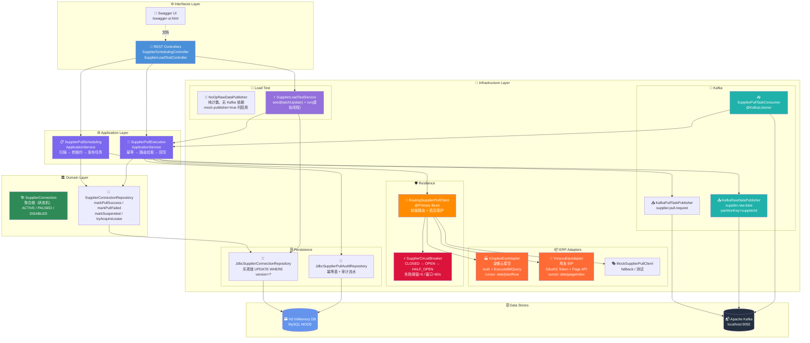
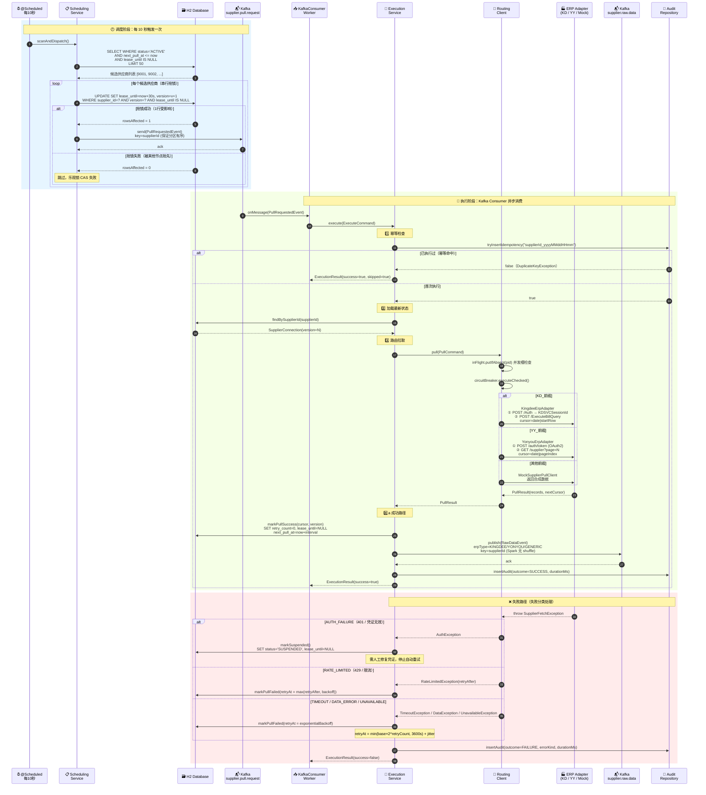
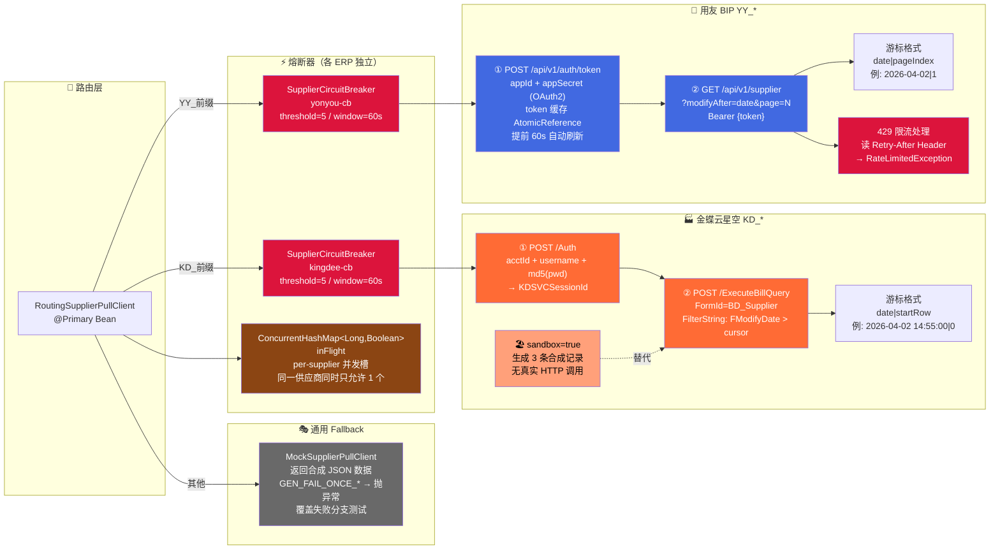
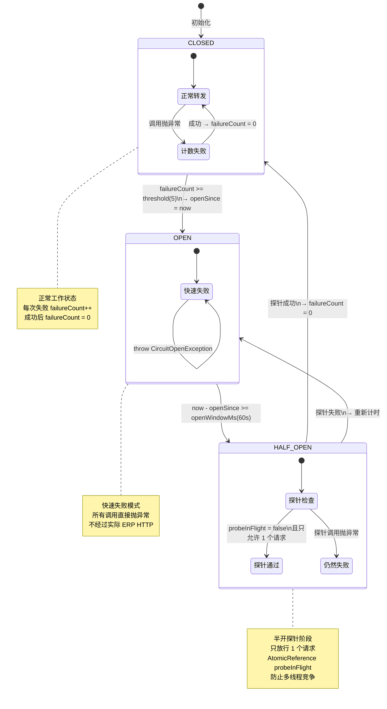
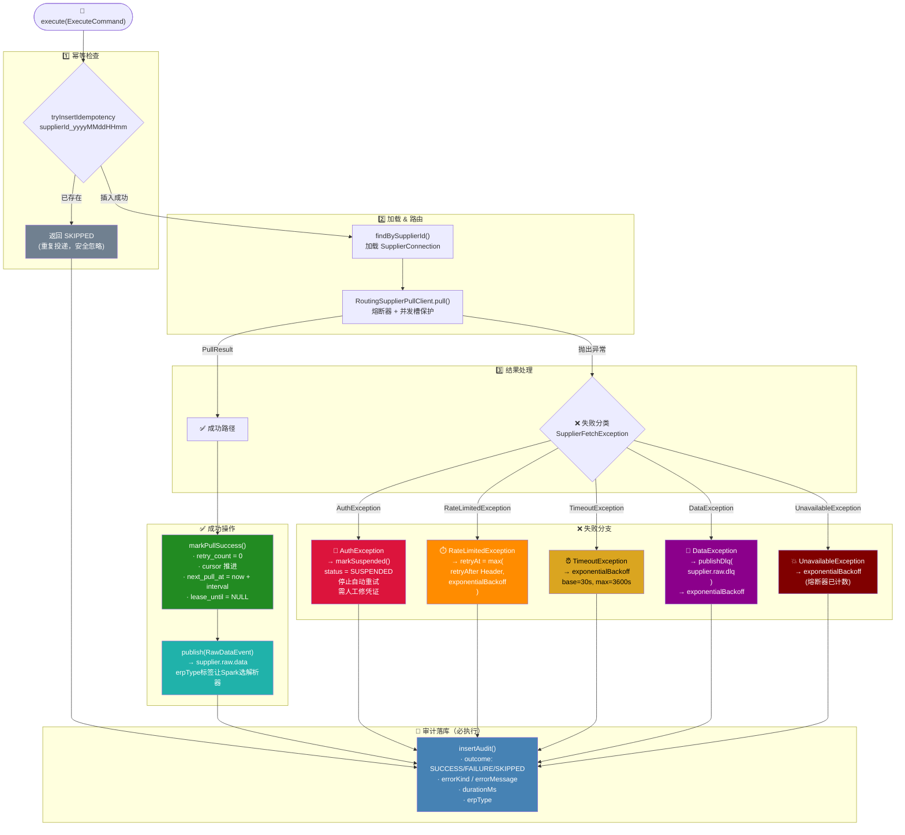
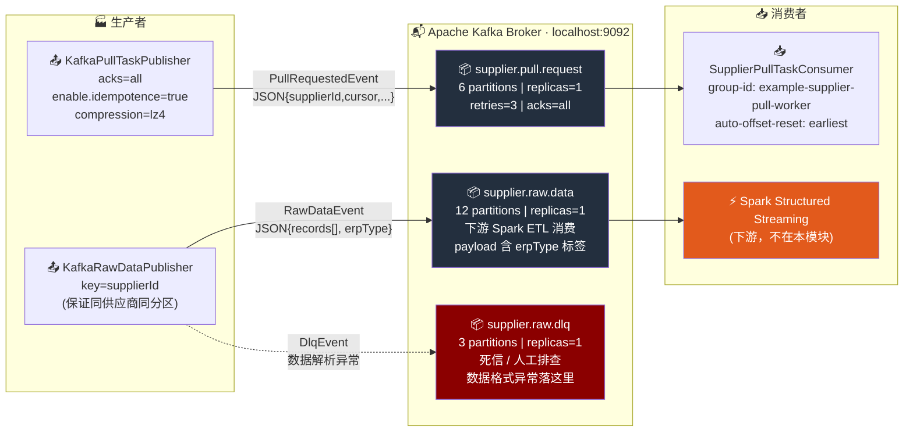
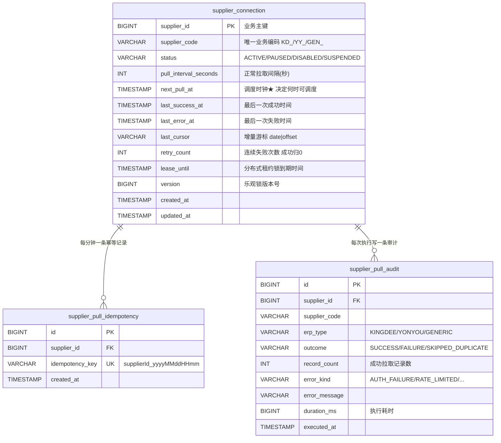
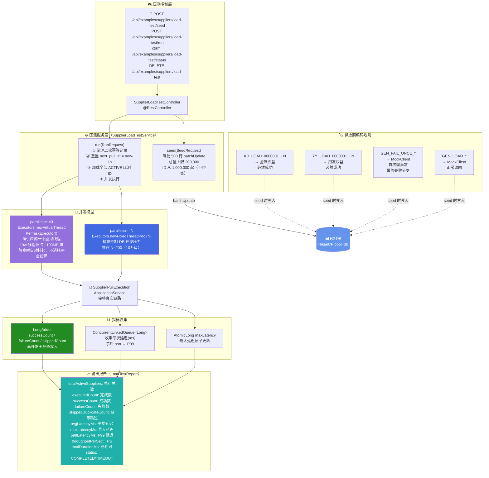
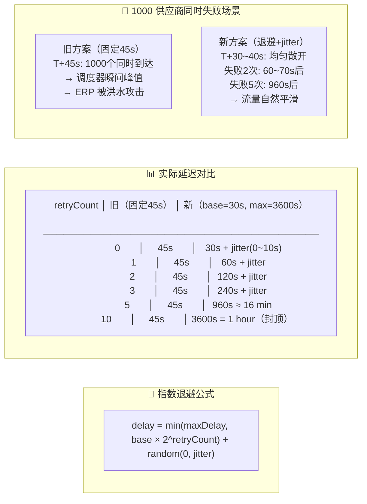

# 供应商 ETL 系统 · 完整技术文档

> **版本**: v2.0 · **日期**: 2026-04-03  
> **模块**: `example` · **包路径**: `xiaowu.example.supplieretl`  
> **作者**: 本次 Copilot 会话完整实现记录

---

## 目录

1. [系统全景](#1-系统全景)
2. [六边形架构图](#2-六边形架构图)
3. [完整调度与执行时序图](#3-完整调度与执行时序图)
4. [ERP 双轨适配器架构](#4-erp-双轨适配器架构)
5. [熔断器三态状态机](#5-熔断器三态状态机)
6. [失败分类与处理流程](#6-失败分类与处理流程)
7. [Kafka 主题拓扑](#7-kafka-主题拓扑)
8. [数据库 ER 图](#8-数据库-er-图)
9. [万级供应商压测架构](#9-万级供应商压测架构)
10. [指数退避算法](#10-指数退避算法)
11. [配置速查表](#11-配置速查表)
12. [API 接口文档](#12-api-接口文档)

---

## 1. 系统全景

```
┌──────────────────────────────────────────────────────────────────────────────────┐
│                        供应商 ETL 系统 · 全景视图                                │
│                                                                                  │
│   ┌─────────┐   ┌─────────┐   REST API            ┌──────────────────────────┐  │
│   │ 金蝶云  │   │ 用友 BIP │  ───────────────────► │  Spring Boot 8924        │  │
│   │ 星空 ERP│   │ OpenAPI  │  Swagger UI           │  · @Scheduled 调度器     │  │
│   │ sandbox │   │ sandbox  │                       │  · Kafka Consumer         │  │
│   └────┬────┘   └────┬─────┘                       │  · HikariCP pool=30      │  │
│        │             │                             └───────────┬──────────────┘  │
│        │ HTTP/JSON   │ HTTP/JSON                               │                 │
│        ▼             ▼                                         │                 │
│   ┌─────────────────────────┐                     ┌───────────▼──────────────┐   │
│   │  RoutingSupplierPull    │   熔断 / 并发隔离    │  Apache Kafka            │   │
│   │  Client（路由 + CBR）   │                      │  · supplier.pull.request │   │
│   │  KD_* → KingdeeAdapter  │                      │    6 partitions          │   │
│   │  YY_* → YonyouAdapter   │                      │  · supplier.raw.data     │   │
│   │  其余 → MockClient      │                      │    12 partitions         │   │
│   └─────────────────────────┘                      │  · supplier.raw.dlq      │   │
│                                                    │    3 partitions          │   │
│   ┌─────────────────────────┐                     └───────────┬──────────────┘   │
│   │  H2 InMemory Database   │                                 │                  │
│   │  · supplier_connection  │   ◄──────────────────────────── │ Spark ETL        │
│   │  · supplier_pull_audit  │     乐观锁 / batchUpdate        │ (下游消费)       │
│   │  · supplier_pull_idempotency│                             └──────────────────┘  │
│   └─────────────────────────┘                                                   │
└──────────────────────────────────────────────────────────────────────────────────┘
```

---

## 2. 六边形架构图



---

## 3. 完整调度与执行时序图



---

## 4. ERP 双轨适配器架构



---

## 5. 熔断器三态状态机



**关键实现细节（`SupplierCircuitBreaker.java`）**：

| 属性 | 类型 | 作用 |
|------|------|------|
| `state` | `AtomicReference<State>` | 三态原子切换，无锁并发安全 |
| `failureCount` | `AtomicInteger` | 连续失败计数 |
| `openSince` | `AtomicLong` | OPEN 状态起始时间戳（ms） |
| `probeInFlight` | `AtomicReference<Boolean>` | HALF_OPEN 探针槽，CAS 保证唯一 |
| `failureThreshold` | `int` | 默认 5，超过则打开熔断 |
| `openWindowMs` | `long` | 默认 60000ms，OPEN 持续时长 |

---

## 6. 失败分类与处理流程



**Sealed 异常层次结构**（`SupplierFetchException.java`）：

```java
sealed class SupplierFetchException extends RuntimeException
    permits AuthException,          // 401 凭证失效
            RateLimitedException,   // 429 携带 Instant retryAfter
            TimeoutException,       // 连接超时 / 读取超时
            DataException,          // 响应格式异常，携带 rawSnippet
            UnavailableException    // 熔断器快速失败
```

---

## 7. Kafka 主题拓扑



**`erpType` 字段用途**：Kafka 消息体中携带 `erpType=KINGDEE|YONYOU|GENERIC`，  
Spark 消费端根据此字段选择对应的 Schema 解析器，**无需修改 Kafka 分区配置**即可扩展新 ERP 类型。

---

## 8. 数据库 ER 图



**索引设计**：

```sql
-- 调度查询主索引（覆盖 WHERE status + next_pull_at 两个过滤条件）
CREATE INDEX idx_supplier_connection_schedule
    ON supplier_connection (status, next_pull_at);

-- 幂等唯一约束（DuplicateKeyException 触发乐观去重）
CREATE UNIQUE INDEX uk_supplier_pull_idempotency_key
    ON supplier_pull_idempotency (idempotency_key);

-- 租约过期扫描索引
CREATE INDEX idx_supplier_connection_lease
    ON supplier_connection (lease_until);
```

---

## 9. 万级供应商压测架构



**性能基准**（H2 内测数据）：

| 规模 | 并发模型 | HikariCP Pool | 预计耗时 | TPS 估算 |
|------|----------|---------------|----------|----------|
| 1 万 | 虚拟线程（parallelism=0） | 30 | 10~30s | 300~1000 |
| 1 万 | 固定线程（parallelism=100） | 30 | 15~40s | 250~700 |
| 10 万 | 固定线程（parallelism=200） | 50 | 60~120s | 800~1700 |

---

## 10. 指数退避算法



**代码位置**（`SupplierConnection.calculateRetryAtWithBackoff()`）：

```java
long exponentialDelay = (long) baseDelaySeconds * (1L << Math.min(retryCount, 30));
long cappedDelay      = Math.min(exponentialDelay, maxDelaySeconds);
long jitterMs         = ThreadLocalRandom.current().nextLong(0, Math.max(1, maxJitterMs));

return baseTime.plusSeconds(cappedDelay).plusNanos(jitterMs * 1_000_000L);
```

**防溢出设计**：`Math.min(retryCount, 30)` 限制移位上限，`2^30 ≈ 10亿秒` 早已超过 `maxDelaySeconds=3600`，`Math.min` 会将其 cap 住，不会 overflow `long`。

---

## 11. 配置速查表

```yaml
supplier:
  # ─── Kafka 主题 ─────────────────────────────────────────────────────────────
  kafka:
    topic:
      pull-request: supplier.pull.request   # 6 partitions
      raw-data:     supplier.raw.data        # 12 partitions（Spark 消费）
      raw-dlq:      supplier.raw.dlq         # 3 partitions（死信）

  # ─── 调度器 ─────────────────────────────────────────────────────────────────
  scheduling:
    enabled: true
    fixed-delay-ms: 10000    # 调度频率：每 10 秒扫一次
    batch-size: 50           # 每轮最多调度 50 个
    lease-seconds: 30        # 租约时长：30 秒后自动超时重调度

  # ─── Worker 执行参数 ────────────────────────────────────────────────────────
  worker:
    enabled: true
    retry-delay-seconds: 45                  # 固定延迟（legacy，新代码用退避）
    retry-backoff-base-seconds: 30           # 退避基准值
    retry-backoff-max-seconds: 3600          # 退避上限：1 小时
    retry-backoff-max-jitter-ms: 10000       # 最大抖动：10 秒

  # ─── 压测开关 ────────────────────────────────────────────────────────────────
  load-test:
    mock-publisher: false   # false=真实Kafka | true=NoOp纯计数

  # ─── ERP 配置 ────────────────────────────────────────────────────────────────
  erp:
    kingdee:
      sandbox: true         # true=沙盒合成数据 | false=真实金蝶
      page-size: 100
      connect-timeout-ms: 5000
      read-timeout-ms: 15000
    yonyou:
      sandbox: true         # true=沙盒合成数据 | false=真实用友
      page-size: 100

# ─── HikariCP 连接池（压测关键参数）──────────────────────────────────────────
spring:
  datasource:
    hikari:
      maximum-pool-size: 30     # 10万级压测建议调至 50
      minimum-idle: 5
      connection-timeout: 30000
      idle-timeout: 600000
```

---

## 12. API 接口文档

### 12.1 调度管理（`SupplierSchedulingController`）

| 方法 | 路径 | 功能 |
|------|------|------|
| `POST` | `/api/examples/suppliers/scheduling/trigger` | 手动触发一轮调度 |
| `GET`  | `/api/examples/suppliers/{supplierId}`        | 查询单个供应商状态 |

### 12.2 压测管理（`SupplierLoadTestController`）

Swagger UI：`http://localhost:8924/swagger-ui.html` → Tag: **Load Test**

| 方法 | 路径 | 功能 | 关键参数 |
|------|------|------|----------|
| `GET`    | `/api/examples/suppliers/load-test/status`      | 数据快照 | — |
| `POST`   | `/api/examples/suppliers/load-test/seed`         | 批量写入合成供应商 | `supplierCount`, `kdRatio`, `yyRatio`, `failRatio`, `reseed` |
| `POST`   | `/api/examples/suppliers/load-test/run`          | 并发执行压测 | `parallelism`, `timeoutSeconds`, `collectLatencies` |
| `POST`   | `/api/examples/suppliers/load-test/seed-and-run` | 一键写入+执行 | `seed{}`, `run{}` |
| `DELETE` | `/api/examples/suppliers/load-test`              | 清理压测数据 | — |

**标准请求示例（1万级压测）**：

```bash
# ① 写入 1 万供应商
curl -X POST http://localhost:8924/api/examples/suppliers/load-test/seed \
  -H "Content-Type: application/json" \
  -d '{
    "supplierCount": 10000,
    "kdRatio": 0.30,
    "yyRatio": 0.30,
    "failRatio": 0.05,
    "reseed": true
  }'
# 响应: {"totalSeeded":10000,"kingdeeCount":3000,"yonyouCount":3000,...}

# ② 虚拟线程并发执行，收集 P99
curl -X POST http://localhost:8924/api/examples/suppliers/load-test/run \
  -H "Content-Type: application/json" \
  -d '{
    "parallelism": 0,
    "timeoutSeconds": 120,
    "collectLatencies": true
  }'
# 响应: {"totalActiveSuppliers":10000,"executedCount":10000,
#         "successCount":9600,"failureCount":200,"skippedDuplicateCount":200,
#         "avgLatencyMs":8.3,"maxLatencyMs":342,"p99LatencyMs":67,
#         "throughputPerSec":1204.8,"totalDurationMs":8308,"status":"COMPLETED"}

# ③ 清理（演示数据 9001-9203 不受影响）
curl -X DELETE http://localhost:8924/api/examples/suppliers/load-test
```

---

## 附录：文件清单

### 本次新增文件

| 文件 | 归属层 | 职责 |
|------|--------|------|
| `application/port/SupplierFetchException.java` | Application/Port | Sealed 失败分类异常层次 |
| `application/port/RawDataPublisher.java` | Application/Port | 原始数据发布端口接口 |
| `infrastructure/adapter/kingdee/KingdeeErpAdapter.java` | Infrastructure | 金蝶云星空 HTTP 适配器 |
| `infrastructure/adapter/kingdee/KingdeeErpProperties.java` | Infrastructure | 金蝶配置 `@ConfigurationProperties` |
| `infrastructure/adapter/yonyou/YonyouErpAdapter.java` | Infrastructure | 用友 BIP OpenAPI 适配器 |
| `infrastructure/adapter/yonyou/YonyouErpProperties.java` | Infrastructure | 用友配置 `@ConfigurationProperties` |
| `infrastructure/adapter/RoutingSupplierPullClient.java` | Infrastructure | 前缀路由 + 熔断 + 并发隔离 `@Primary` |
| `infrastructure/resilience/SupplierCircuitBreaker.java` | Infrastructure | 手写三态熔断器（CLOSED/OPEN/HALF_OPEN）|
| `infrastructure/kafka/KafkaRawDataPublisher.java` | Infrastructure | `supplier.raw.data` + DLQ Kafka 发布者 |
| `infrastructure/audit/SupplierPullAuditRepository.java` | Infrastructure | 幂等 + 审计接口 |
| `infrastructure/audit/JdbcSupplierPullAuditRepository.java` | Infrastructure | JDBC 实现 |
| `infrastructure/loadtest/NoOpRawDataPublisher.java` | Infrastructure | 无 Kafka 依赖的纯计数发布者 |
| `infrastructure/loadtest/SupplierLoadTestService.java` | Infrastructure | 压测核心：seed + run + status + cleanup |
| `infrastructure/config/SupplierLoadTestConfiguration.java` | Infrastructure | 压测 Bean 配置（mock-publisher 开关）|
| `interfaces/rest/SupplierLoadTestController.java` | Interfaces | 压测 REST API（5 个接口）|

### 本次修改文件

| 文件 | 修改内容 |
|------|----------|
| `SupplierPullExecutionApplicationService.java` | **完整重写**：幂等→路由→失败分类→DLQ→审计 |
| `SupplierRuntimeConfiguration.java` | 注入全部新 Bean |
| `SupplierConnectionRepository.java` | 新增 `markSuspended()` |
| `JdbcSupplierConnectionRepository.java` | 实现 `markSuspended()` |
| `SupplierKafkaProperties.java` | Topic record 新增 `rawData` / `rawDlq` |
| `SupplierKafkaConfiguration.java` | 新增 rawData/DLQ topic Bean + `RawDataPublisher` Bean |
| `application.yml` | ERP 配置块 + HikariCP pool + load-test 开关 |
| `schema.sql` | 新增 `supplier_pull_idempotency` + `supplier_pull_audit` 表 |
| `data.sql` | 新增 KD_/YY_ 种子数据（9101~9203）|
| `example/pom.xml` | 覆盖 `java.version=21` 启用虚拟线程 API |

---

*文档由 GitHub Copilot 根据本次会话实现自动生成 · 2026-04-03*
